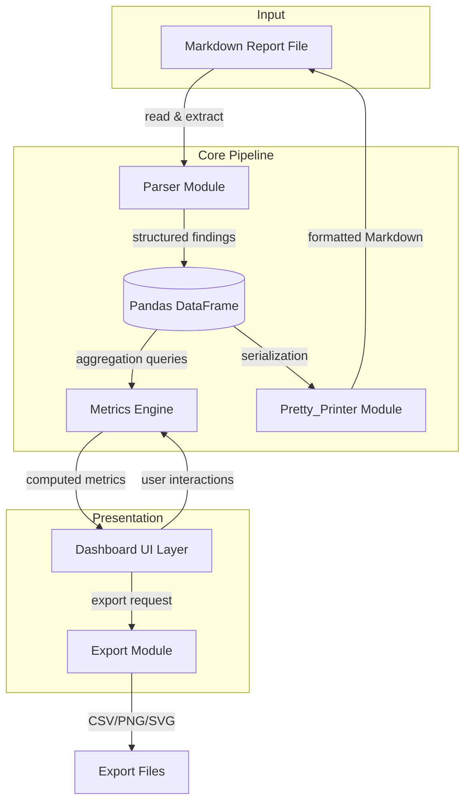
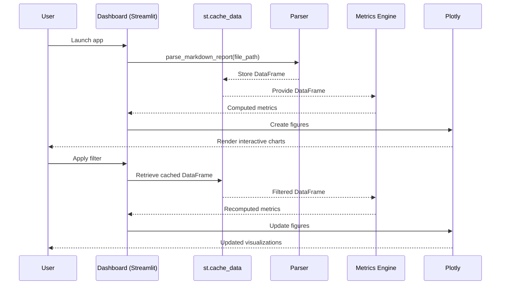

# Design Document: SGI Audit Dashboard

## Overview

The SGI Audit Dashboard is a Streamlit-based interactive visualization application that transforms a Markdown-formatted SGI audit findings report into a strategic decision-making tool. The system follows a modular pipeline architecture: **Markdown → Parser → DataFrame → Metrics Engine → Streamlit Visualizations**.

The application supports CONPREM GRAU's Integrated Management System (SGI) covering ISO 9001:2015, ISO 14001:2015, and ISO 45001:2018. It provides plant management and quality teams with real-time risk scoring, Pareto analysis, maturity indexing, and compliance metrics across 10 operational process zones.

**Key Design Decisions:**
- **Streamlit** chosen for rapid prototyping, built-in dark theme, reactive data binding, and zero-frontend-build deployment
- **Pandas** for in-memory tabular data manipulation with rich aggregation support
- **Plotly** for interactive vector charts with SVG export, dark theme support, and hover tooltips
- **Hypothesis** for property-based testing of round-trip, scoring invariants, and filter logic
- **Dataclasses** for type-safe, self-documenting data models

---

## Architecture

### High-Level System Architecture



### Layered Architecture

| Layer | Responsibility | Dependencies |
|-------|---------------|--------------|
| **UI Layer** (Dashboard) | Streamlit layout, filter controls, visualization rendering | Metrics Engine, DataFrame |
| **Metrics Engine** (Data_Pipeline) | Risk scoring, Pareto computation, maturity indexing, criticality rates | DataFrame |
| **Parser** | Markdown → DataFrame transformation, validation | Dataclass model |
| **Pretty_Printer** | DataFrame → Markdown serialization, round-trip guarantee | Dataclass model |
| **Data Model** | Finding dataclass, validation rules, type constraints | None (leaf) |

### Deployment Model

Single-process Streamlit application running locally or on a LAN server. No database required — the Markdown file is the single source of truth. DataFrame is cached in memory via `st.cache_data` after initial parse.

---

## Components and Interfaces

### High-Level Component Diagram

```mermaid
graph LR
    subgraph parser[Parser Module]
        PMR[parse_markdown_report]
        ESF[extract_section_findings]
        VFS[validate_finding_structure]
    end

    subgraph pretty_printer[Pretty_Printer Module]
        FTM[format_to_markdown]
        VRT[validate_roundtrip]
    end

    subgraph metrics[Metrics Engine]
        RLS[calculate_risk_load_score]
        CR[calculate_criticality_rate]
        MI[calculate_maturity_index]
        PT[calculate_pareto_threshold]
    end

    subgraph dashboard[Dashboard UI Layer]
        ES[render_executive_summary]
        PC[render_pareto_chart]
        RH[render_risk_heatmap]
        MR[render_maturity_radar]
        FT[render_findings_table]
        HP[render_hts_panel]
        TL[render_timeline]
        FS[render_filters_sidebar]
    end

    PMR --> ESF
    PMR --> VFS
    PMR -->|DataFrame| metrics
    metrics -->|computed metrics| dashboard
    FTM -->|Markdown string| VRT
    VRT -->|uses| PMR
```



### Low-Level Module Design

#### 1. Parser Module (`parser.py`)

**Responsibility:** Read a Markdown audit report file and extract structured finding data into a Pandas DataFrame.

```python
from dataclasses import dataclass
from typing import Optional
import pandas as pd


@dataclass
class ValidationResult:
    """Result of finding structure validation."""
    is_valid: bool
    errors: list[str]  # List of field-level error descriptions
    line_number: Optional[int] = None
    section_heading: Optional[str] = None


def parse_markdown_report(file_path: str) -> pd.DataFrame:
    """
    Parse a Markdown audit report and return a DataFrame of findings.

    Args:
        file_path: Absolute or relative path to the .md file.

    Returns:
        DataFrame with columns: finding_id, finding_type, description,
        standards (list), process_zone, clause_ref, evidence,
        is_transversal, responsible_party, deadline,
        estimated_mitigation_cost, corrective_action_status.

    Raises:
        ParserError: If the file is malformed, with line_number,
                     field_name, and expected_format attributes.
    """
    ...


def extract_section_findings(
    section_text: str,
    finding_type: str
) -> list['Finding']:
    """
    Extract all findings of a given type from a section of Markdown text.

    Args:
        section_text: The raw Markdown text of one finding-type section.
        finding_type: One of "NCM", "NCm", "ODM", "OBS".

    Returns:
        List of Finding dataclass instances extracted from the section.

    Algorithm:
        1. Split section by finding ID pattern (e.g., "NCM-\\d+")
        2. For each match, extract fields using regex patterns
        3. Validate each extracted finding
        4. Return list of validated Finding objects
    """
    ...


def validate_finding_structure(finding: 'Finding') -> ValidationResult:
    """
    Validate that a Finding has all required fields with correct formats.

    Required fields: finding_id, finding_type, description,
                     standards (non-empty), process_zone.
    Format rules:
        - finding_id: matches pattern (NCM|NCm|ODM|OBS)-\\d{2}
        - clause_ref: matches pattern \\d+\\.\\d+(\\.\\d+)?
        - description: max 2000 characters
        - evidence: max 5000 characters

    Returns:
        ValidationResult with is_valid=True if all checks pass,
        or is_valid=False with detailed error list.
    """
    ...
```

**Parsing Algorithm Pseudocode:**

```
FUNCTION parse_markdown_report(file_path):
    content = read_file(file_path)
    sections = split_by_finding_type_headers(content)
    all_findings = []

    FOR EACH (section_text, finding_type) IN sections:
        findings = extract_section_findings(section_text, finding_type)
        all_findings.extend(findings)

    # Expand multi-norm findings: one row per standard
    expanded_rows = []
    FOR EACH finding IN all_findings:
        IF len(finding.standards) > 1:
            FOR EACH standard IN finding.standards:
                row = finding.to_row(standard=standard)
                expanded_rows.append(row)
        ELSE:
            expanded_rows.append(finding.to_row())

    RETURN pd.DataFrame(expanded_rows)
```

---

#### 2. Pretty_Printer Module (`pretty_printer.py`)

**Responsibility:** Serialize a findings DataFrame back into valid pipe-delimited Markdown tables.

```python
import pandas as pd


def format_to_markdown(df: pd.DataFrame) -> str:
    """
    Format a findings DataFrame into a Markdown table string.

    Column order: ID | Type | Standard(s) | Process Zone | Clause |
                  Description | Evidence

    Args:
        df: DataFrame with required columns. Must not have null values
            in mandatory fields (finding_id, finding_type, process_zone).

    Returns:
        Markdown string with pipe-delimited table, header row,
        and separator row.

    Raises:
        SerializationError: If required columns are missing or mandatory
                           fields contain null values. Error specifies
                           affected rows and columns.
    """
    ...


def validate_roundtrip(original_md: str, df: pd.DataFrame) -> bool:
    """
    Validate that parse(print(df)) produces a DataFrame identical to df.

    This implements the round-trip invariant:
        parse(format_to_markdown(parse(original_md))) == parse(original_md)

    Args:
        original_md: The original Markdown source text.
        df: The DataFrame produced by parsing original_md.

    Returns:
        True if round-trip produces identical DataFrame, False otherwise.

    Comparison:
        - Same column names
        - Same row count
        - Cell-by-cell string equality (after stripping whitespace)
    """
    ...
```

**Serialization Algorithm Pseudocode:**

```
FUNCTION format_to_markdown(df):
    # Validate required columns exist
    required = ["finding_id", "finding_type", "process_zone"]
    FOR col IN required:
        IF col NOT IN df.columns:
            RAISE SerializationError(missing_column=col)
        IF df[col].isnull().any():
            bad_rows = df[df[col].isnull()].index.tolist()
            RAISE SerializationError(null_rows=bad_rows, column=col)

    # Build Markdown table
    columns = ["ID", "Type", "Standard(s)", "Process Zone",
               "Clause", "Description", "Evidence"]
    header = "| " + " | ".join(columns) + " |"
    separator = "| " + " | ".join(["---"] * len(columns)) + " |"

    rows = []
    FOR EACH row IN df.itertuples():
        cells = [
            row.finding_id,
            row.finding_type,
            row.standards or "",
            row.process_zone,
            row.clause_ref or "",
            row.description or "",
            row.evidence or ""
        ]
        rows.append("| " + " | ".join(cells) + " |")

    RETURN "\n".join([header, separator] + rows)
```

---

#### 3. Metrics Engine (`metrics.py`)

**Responsibility:** Compute all derived metrics from the findings DataFrame.

```python
import pandas as pd
from typing import Optional


# Weight constants
WEIGHTS = {
    "NCM": 5.0,
    "NCm": 2.0,
    "ODM": 1.0,
    "OBS": 0.5
}


def calculate_risk_load_score(
    df: pd.DataFrame,
    group_by: str = "process_zone"
) -> pd.Series:
    """
    Calculate weighted Risk_Load_Score grouped by the specified column.

    Formula: sum(NCM×5 + NCm×2 + ODM×1 + OBS×0.5) per group.

    Args:
        df: Findings DataFrame with 'finding_type' and group_by columns.
        group_by: Column name to group by. One of "process_zone",
                  "standards", or "clause_ref".

    Returns:
        Series indexed by group values with float scores (1 decimal).

    Special cases:
        - Groups with zero findings: score = 0.0
        - Multi-standard findings: counted once per zone-level grouping
    """
    ...


def calculate_criticality_rate(df: pd.DataFrame) -> dict[str, float]:
    """
    Calculate Criticality_Rate per ISO standard.

    Formula: NCM_count / total_count per standard.

    Args:
        df: Findings DataFrame with 'finding_type' and 'standards' columns.

    Returns:
        Dict mapping standard name to rate (0.0 to 100.0, 1 decimal place).
        Standards with zero findings return 0.0.

    Example:
        {"ISO 9001:2015": 33.3, "ISO 14001:2015": 25.0, "ISO 45001:2018": 40.0}
    """
    ...


def calculate_maturity_index(df: pd.DataFrame) -> dict[str, float]:
    """
    Calculate Maturity_Index per process zone.

    Formula: 100 - (Risk_Load_Score / (finding_count × 5)) × 100
    Where finding_count is unique findings in the zone (not expanded rows).

    Args:
        df: Findings DataFrame with 'process_zone' and 'finding_type'.

    Returns:
        Dict mapping zone name to maturity score (0.0 to 100.0, 1 decimal).
        Zones with zero findings return 100.0.

    Invariant: 0.0 <= result <= 100.0 for all zones.
    """
    ...


def calculate_pareto_threshold(
    scores: pd.Series,
    threshold: float = 0.8
) -> tuple[list[str], list[str], pd.Series]:
    """
    Determine the Pareto 80/20 boundary for a scored Series.

    Args:
        scores: Series of scores indexed by category (zone or clause).
        threshold: Cumulative percentage cutoff (default 0.8 = 80%).

    Returns:
        Tuple of:
          - critical_categories: list of categories up to threshold
          - remaining_categories: list below threshold
          - cumulative_pct: Series of cumulative percentages

    Algorithm:
        1. Sort scores descending
        2. Compute total = sum(scores)
        3. Compute cumulative_pct = cumsum(scores) / total
        4. Find index where cumulative_pct first exceeds threshold
        5. Split into critical (up to index) and remaining

    Invariant: cumulative_pct[-1] == 1.0 (100%)
    """
    ...
```

**Key Algorithm Pseudocode:**

```
ALGORITHM Risk_Load_Score(findings, group_by):
    INPUT: list of findings, grouping column name
    OUTPUT: dict of {group_value: weighted_score}

    scores = {}
    FOR EACH group_value IN unique(findings[group_by]):
        group_findings = findings WHERE [group_by] == group_value

        # Deduplicate for zone-level scoring
        IF group_by == "process_zone":
            group_findings = deduplicate_by_finding_id(group_findings)

        score = 0.0
        FOR EACH finding IN group_findings:
            score += WEIGHTS[finding.finding_type]

        scores[group_value] = round(score, 1)

    RETURN scores


ALGORITHM Maturity_Index(findings_per_zone):
    INPUT: dict of {zone: list of findings}
    OUTPUT: dict of {zone: maturity_score}

    maturity = {}
    FOR EACH zone, findings IN findings_per_zone:
        IF len(findings) == 0:
            maturity[zone] = 100.0
            CONTINUE

        unique_findings = deduplicate_by_finding_id(findings)
        count = len(unique_findings)
        max_possible_score = count * 5.0  # All NCM worst case
        actual_score = Risk_Load_Score(unique_findings)
        maturity[zone] = round(100.0 - (actual_score / max_possible_score) * 100.0, 1)

    RETURN maturity


ALGORITHM Criticality_Rate(findings_per_standard):
    INPUT: dict of {standard: list of findings}
    OUTPUT: dict of {standard: rate_percentage}

    rates = {}
    FOR EACH standard, findings IN findings_per_standard:
        total = len(findings)
        IF total == 0:
            rates[standard] = 0.0
            CONTINUE

        ncm_count = count WHERE finding.type == "NCM"
        rates[standard] = round((ncm_count / total) * 100.0, 1)

    RETURN rates


ALGORITHM Pareto_80_20(scores):
    INPUT: Series of scores indexed by category
    OUTPUT: (critical_list, remaining_list, cumulative_percentages)

    sorted_scores = sort_descending(scores)
    total = sum(sorted_scores)

    IF total == 0:
        RETURN ([], list(scores.index), Series of zeros)

    cumulative = cumsum(sorted_scores) / total
    boundary_idx = first_index_where(cumulative >= 0.8)

    critical = sorted_scores.index[:boundary_idx + 1]
    remaining = sorted_scores.index[boundary_idx + 1:]

    RETURN (list(critical), list(remaining), cumulative)
```

---

#### 4. Dashboard Renderers (`dashboard/`)

**Responsibility:** Streamlit UI components that render visualizations and handle user interactions.

```python
import streamlit as st
import pandas as pd
import plotly.graph_objects as go
from dataclasses import dataclass
from typing import Optional


@dataclass
class FilterState:
    """Immutable snapshot of active filter selections."""
    standards: list[str]       # Selected ISO standards
    finding_types: list[str]   # Selected finding types
    process_zones: list[str]   # Selected process zones
    search_text: str = ""      # Substring search query


def render_filters_sidebar() -> FilterState:
    """
    Render filter controls in the Streamlit sidebar.

    Controls:
        - st.multiselect for standards (default: all 3)
        - st.multiselect for finding types (default: all 4)
        - st.multiselect for process zones (default: all 10)
        - st.text_input for substring search

    Returns:
        FilterState capturing current user selections.

    Behavior:
        - All values selected by default on load
        - AND logic between categories, OR within
        - Persistent display of active filter summary
    """
    ...


def apply_filters(df: pd.DataFrame, filters: FilterState) -> pd.DataFrame:
    """
    Apply FilterState to DataFrame using AND between categories, OR within.

    Args:
        df: Full findings DataFrame.
        filters: Current filter selections.

    Returns:
        Filtered DataFrame. May be empty if no matches.

    Invariant: apply_filters(apply_filters(df, f), f) == apply_filters(df, f)
    """
    ...


def render_executive_summary(df: pd.DataFrame, metrics: dict) -> None:
    """
    Render the executive summary panel as the first dashboard section.

    Displays:
        - Total finding count (st.metric)
        - Total Risk_Load_Score (st.metric, 1 decimal)
        - Overall compliance health % (st.metric, 1 decimal)
        - Count per finding type (4 × st.metric in columns)
        - HTS alert indicator (st.error with icon if HTS present)

    Args:
        df: Currently filtered findings DataFrame.
        metrics: Dict containing pre-computed risk scores and rates.
    """
    ...


def render_pareto_chart(
    df: pd.DataFrame,
    metrics: dict,
    filters: FilterState
) -> None:
    """
    Render primary and secondary Pareto charts.

    Primary: Process zones by descending Risk_Load_Score.
    Secondary: Clause references by descending finding count.

    Both charts include:
        - Vertical bars (descending order)
        - Cumulative % line on secondary y-axis (0-100%)
        - 80% threshold line with color boundary
        - Dark theme compatible colors

    Uses Plotly Figure with dual y-axis.
    """
    ...


def render_risk_heatmap(df: pd.DataFrame, filters: FilterState) -> None:
    """
    Render the Risk_Load_Score heatmap: zones × standards.

    Implementation:
        - Plotly Heatmap or px.imshow
        - Sequential color scale (e.g., Plasma for dark mode)
        - Numeric annotations in each cell
        - Zero-value cells in neutral gray
        - Hover tooltip: score + per-type breakdown

    Axes:
        - Y: 10 process zones
        - X: 3 ISO standards
    """
    ...


def render_maturity_radar(df: pd.DataFrame, metrics: dict) -> None:
    """
    Render radar chart comparing Maturity_Index across zones.

    Implementation:
        - Plotly Scatterpolar
        - One axis per process zone (10 axes)
        - Scale: 0-100
        - Fill area for visual impact
        - Dark mode compatible
    """
    ...


def render_findings_table(df: pd.DataFrame, filters: FilterState) -> None:
    """
    Render the interactive findings table with search and sort.

    Features:
        - Columns: ID, Type, Standard(s), Process Zone, Clause, Description
        - Description truncated at 120 chars with "..."
        - Sort by any column (default: ID ascending)
        - Case-insensitive substring search (min 2 chars)
        - Row click → detail view (st.expander or modal)
        - Empty-state message if no matches
    """
    ...


def render_hts_panel(df: pd.DataFrame) -> None:
    """
    Render the dedicated HTS-01 systemic finding panel.

    Conditional: Only renders if HTS finding exists in dataset.

    Content:
        - Finding description
        - All affected zones (visual diagram)
        - All affected standards
        - Systemic nature explanation
        - Distinct border/background (st.container with custom CSS)

    If HTS has incomplete metadata, shows available fields
    with "Data not available" placeholders for missing ones.
    """
    ...


def render_timeline(df: pd.DataFrame) -> None:
    """
    Render corrective action Gantt-style timeline.

    Implementation:
        - Plotly Timeline (px.timeline) or Gantt chart
        - Up to 50 visible actions (pagination beyond)
        - Color coding: gray=not started, blue=in_progress,
          green=completed, red=overdue
        - Overdue: current_date > deadline AND status != "completed"
        - Missing fields → "Pending Assignment" placeholder

    Args:
        df: Findings DataFrame with optional CAPA fields.
    """
    ...
```

---

## Data Models

### Core Finding Dataclass

```python
from dataclasses import dataclass, field
from typing import Optional
from datetime import date
from enum import Enum


class FindingType(Enum):
    NCM = "NCM"   # No Conformidad Mayor (Major Non-Conformity)
    NCm = "NCm"   # No Conformidad Menor (Minor Non-Conformity)
    ODM = "ODM"   # Oportunidad de Mejora (Opportunity for Improvement)
    OBS = "OBS"   # Observación (Observation)


class CorrectiveActionStatus(Enum):
    OPEN = "open"
    IN_PROGRESS = "in_progress"
    COMPLETED = "completed"
    VERIFIED = "verified"
    CLOSED = "closed"


PROCESS_ZONES = [
    "Logistics",
    "Storage Yard",
    "Manufacturing/Prestressing",
    "Lab",
    "Boilers",
    "Aggregates",
    "Steel Storage",
    "Chemical Storage",
    "Document Management",
    "General/Transversal",
]

STANDARDS = [
    "ISO 9001:2015",
    "ISO 14001:2015",
    "ISO 45001:2018",
]

FINDING_WEIGHTS: dict[str, float] = {
    "NCM": 5.0,
    "NCm": 2.0,
    "ODM": 1.0,
    "OBS": 0.5,
}


@dataclass
class Finding:
    """Represents a single audit finding with all metadata."""

    # Required fields
    finding_id: str                      # e.g., "NCM-01", "OBS-05"
    finding_type: FindingType            # NCM, NCm, ODM, OBS
    description: str                     # Max 2000 characters
    standards: list[str]                 # One or more ISO standards
    process_zone: str                    # Must be in PROCESS_ZONES

    # Optional fields (may be null/absent in source)
    clause_ref: Optional[str] = None     # Format: "X.Y.Z"
    evidence: Optional[str] = None       # Max 5000 characters
    is_transversal: bool = False         # True for HTS findings

    # Future extensibility fields (Requirement 16)
    responsible_party: Optional[str] = None           # Max 150 chars
    deadline: Optional[date] = None                   # ISO 8601
    estimated_mitigation_cost: Optional[float] = None # 0.01 - 999,999,999.99
    corrective_action_status: Optional[CorrectiveActionStatus] = None
```

### DataFrame Schema

| Column | Type | Nullable | Description |
|--------|------|----------|-------------|
| `finding_id` | str | No | Unique finding identifier |
| `finding_type` | str | No | One of NCM, NCm, ODM, OBS |
| `description` | str | No | Finding description (max 2000 chars) |
| `standards` | str | No | ISO standard for this row |
| `process_zone` | str | No | Operational area |
| `clause_ref` | str | Yes | ISO clause reference (X.Y.Z) |
| `evidence` | str | Yes | Supporting evidence text |
| `is_transversal` | bool | No | HTS flag (default False) |
| `responsible_party` | str | Yes | Assigned person |
| `deadline` | str | Yes | ISO 8601 date string |
| `estimated_mitigation_cost` | float | Yes | Cost estimate |
| `corrective_action_status` | str | Yes | CAPA status |

**Note:** Multi-norm findings are expanded into multiple rows (one per standard), sharing all other field values. Zone-level aggregation deduplicates by `finding_id`.

### Data Flow Diagram



---

## Correctness Properties

*A property is a characteristic or behavior that should hold true across all valid executions of a system — essentially, a formal statement about what the system should do. Properties serve as the bridge between human-readable specifications and machine-verifiable correctness guarantees.*

### Property 1: Parser-Printer Round-Trip Idempotence

*For any* valid Markdown audit report containing 1 to 200 findings, applying `parse` then `format_to_markdown` then `parse` SHALL produce a DataFrame with identical column names, identical row count, and cell-by-cell string equality to the DataFrame produced by the first `parse` invocation.

**Validates: Requirements 2.1, 2.2**

### Property 2: Risk_Load_Score Monotonicity (NCM Addition)

*For any* process zone with an existing set of findings, adding one finding of type NCM to that zone SHALL increase the zone's Risk_Load_Score by exactly 5.0, adding one NCm SHALL increase by exactly 2.0, adding one ODM SHALL increase by exactly 1.0, and adding one OBS SHALL increase by exactly 0.5.

**Validates: Requirements 3.1, 3.5**

### Property 3: Maturity_Index Bounds

*For any* process zone and any non-empty set of findings assigned to that zone, the calculated Maturity_Index SHALL be a value in the closed interval [0.0, 100.0]. A zone with zero findings SHALL have a Maturity_Index of exactly 100.0.

**Validates: Requirements 7.1, 7.2, 7.4**

### Property 4: Pareto Cumulative Completeness

*For any* non-empty dataset of findings, the cumulative percentage line of the Pareto chart SHALL have a final value of exactly 100.0%, and the sum of individual bar percentages SHALL equal 100.0%.

**Validates: Requirements 4.1, 4.2**

### Property 5: Filter Idempotence

*For any* FilterState `f` and any findings DataFrame `df`, applying the filter function twice SHALL produce the same result as applying it once: `apply_filters(apply_filters(df, f), f) == apply_filters(df, f)`.

**Validates: Requirements 9.2, 9.3, 9.5**

### Property 6: Filter Logic Correctness (AND/OR)

*For any* combination of filter selections with multiple values within a category and selections across multiple categories, the filtered result SHALL include exactly those findings where at least one selected value matches within EACH active filter category (OR within category, AND between categories).

**Validates: Requirements 9.3**

### Property 7: Criticality_Rate Domain Bounds

*For any* ISO standard and any set of findings for that standard, the Criticality_Rate SHALL be a value in the closed interval [0.0, 100.0]. When total findings for a standard is zero, the rate SHALL be 0.0 (no division by zero).

**Validates: Requirements 6.1, 6.4, 6.5**

### Property 8: Multi-Standard Finding Counting Consistency

*For any* finding that affects N standards (N > 1), the standard-level aggregation SHALL count that finding N times (once per standard), while the zone-level aggregation SHALL count that finding exactly once.

**Validates: Requirements 1.2, 3.2**

### Property 9: Finding ID Preservation

*For any* valid Markdown input containing findings with IDs matching the pattern `(NCM|NCm|ODM|OBS)-\d{2}`, the Parser SHALL produce a DataFrame where every `finding_id` value is character-for-character identical to the corresponding ID in the source document.

**Validates: Requirements 1.4**

### Property 10: Compliance Health Bounds and Formula Consistency

*For any* dataset of findings, the overall compliance health percentage SHALL be in the closed interval [0.0, 100.0], calculated as `(1 - actual_score / (total_unique_findings × 5)) × 100`. An empty dataset SHALL produce a compliance health of 100.0%.

**Validates: Requirements 8.3, 8.5**

### Property 11: Optional Field Schema Preservation

*For any* finding with one or more optional fields (responsible_party, deadline, estimated_mitigation_cost, corrective_action_status) set to null, serialization to JSON SHALL include those fields with JSON null values, and serialization to Markdown SHALL include empty cells, preserving the complete schema structure.

**Validates: Requirements 2.5, 16.1, 16.2**

### Property 12: Date Validation Correctness

*For any* string in valid ISO 8601 format (YYYY-MM-DD representing a real calendar date), the deadline validator SHALL accept it. *For any* string not conforming to ISO 8601 date format, the validator SHALL reject it with an error message.

**Validates: Requirements 16.3**

### Property 13: Description Truncation Invariant

*For any* finding description string, the table display SHALL show the full text if length ≤ 120 characters, or exactly the first 120 characters followed by "..." if length > 120 characters.

**Validates: Requirements 10.1**

### Property 14: Pareto Ordering Invariant

*For any* non-empty dataset, the Pareto chart bars SHALL be in strictly non-increasing order of Risk_Load_Score (or finding count for clause-based Pareto), and the cumulative percentage line SHALL be monotonically non-decreasing.

**Validates: Requirements 4.1, 4.5**

### Property 15: Heatmap Cell Score Accuracy

*For any* (process_zone, standard) pair in the heatmap, the displayed numeric value SHALL equal the Risk_Load_Score computed for the subset of findings matching both that zone and that standard.

**Validates: Requirements 5.1, 5.2**

---

## Error Handling

### Error Categories

| Error Type | Module | Cause | User-Facing Message |
|-----------|--------|-------|---------------------|
| `ParserError` | Parser | Malformed Markdown, missing required fields | "Error parsing line {n}: field '{field}' is missing or malformed. Expected format: {format}" |
| `SerializationError` | Pretty_Printer | Missing required columns or null mandatory fields | "Cannot serialize: rows {rows} have null values in column '{col}'" |
| `ValidationError` | Data Model | Invalid field values (bad dates, out-of-range costs) | "Validation failed for finding {id}: {field} value '{value}' does not match expected format" |
| `DatasetSizeError` | Data Pipeline | Dataset exceeds 200 findings | "Dataset contains {n} findings. Maximum supported: 200." |
| `ExportError` | Export Module | Export generation failure | "Export failed: {reason}. No file was generated." |
| `FilterEmptyError` | Dashboard | Filters produce zero results | (Not an exception — renders empty-state UI message) |

### Error Handling Strategy

1. **Fail-fast on parse:** If the Markdown source is invalid, the application shows a clear error before any visualization renders.
2. **Graceful degradation for optional fields:** Missing optional data never blocks rendering — placeholders are shown instead.
3. **No partial outputs:** Pretty_Printer and Export module either produce complete valid output or no output at all.
4. **Division-safe calculations:** All division operations check for zero denominators and return 0.0 as the defined default.
5. **Streamlit error display:** Use `st.error()` for critical errors and `st.warning()` for degraded states (e.g., partial HTS data).

---

## Testing Strategy

### Testing Approach: Dual Methodology

This feature uses both **example-based unit tests** and **property-based tests** for comprehensive coverage.

**Property-based testing is appropriate** because:
- The Parser and Pretty_Printer are pure transformation functions with clear round-trip behavior
- Scoring formulas are pure computations with universal mathematical invariants
- Filter logic has algebraic properties (idempotence, AND/OR correctness)
- The input space is large (arbitrary valid Markdown, arbitrary finding combinations)

### Technology Stack

- **pytest** — test runner and fixtures
- **Hypothesis** — property-based testing library for Python
  - `@given` decorator for test parametrization
  - Custom strategies for generating valid findings, Markdown, and filter states
  - Minimum **100 iterations** per property test
- **pytest-cov** — coverage measurement

### Property-Based Tests (Hypothesis)

Each test references its design property and runs 100+ iterations:

| Test | Property | Hypothesis Strategy |
|------|----------|-------------------|
| `test_roundtrip_idempotence` | Property 1 | Generate random valid Markdown reports (1-50 findings) |
| `test_risk_score_monotonicity` | Property 2 | Generate random zones + add single finding of each type |
| `test_maturity_index_bounds` | Property 3 | Generate random finding distributions per zone |
| `test_pareto_completeness` | Property 4 | Generate random score distributions |
| `test_filter_idempotence` | Property 5 | Generate random DataFrames + random FilterStates |
| `test_filter_and_or_logic` | Property 6 | Generate complex multi-filter combinations |
| `test_criticality_rate_bounds` | Property 7 | Generate random standard/finding distributions |
| `test_multi_standard_counting` | Property 8 | Generate findings with 1-3 standards |
| `test_finding_id_preservation` | Property 9 | Generate random valid IDs in Markdown |
| `test_compliance_health_bounds` | Property 10 | Generate random datasets (0-200 findings) |
| `test_optional_field_schema` | Property 11 | Generate findings with random null optionals |
| `test_date_validation` | Property 12 | Generate valid ISO dates + invalid strings |
| `test_description_truncation` | Property 13 | Generate strings of varying lengths |
| `test_pareto_ordering` | Property 14 | Generate random non-empty datasets |
| `test_heatmap_cell_accuracy` | Property 15 | Generate random findings across zones/standards |

**Tag format:** Each test includes a docstring comment:
```python
# Feature: sgi-audit-dashboard, Property 1: Parser-Printer Round-Trip Idempotence
```

### Example-Based Unit Tests

| Test Category | Coverage |
|---------------|----------|
| Parser: known valid file → expected DataFrame | Req 1.1 |
| Parser: malformed file → specific error | Req 1.3 |
| HTS detection and zone association | Req 1.5 |
| Executive summary with HTS alert | Req 8.4 |
| Empty dataset → all zeros + 100% health | Req 8.5 |
| HTS panel hidden when absent | Req 11.4 |
| Timeline color-coding by status | Req 12.4 |
| Dark theme contrast ratios | Req 13.3 |
| Dataset >200 → error message | Req 14.5 |
| Zero-match export → no file + message | Req 15.4 |

### Integration Tests

| Test | Requirement |
|------|-------------|
| Full pipeline: file → parse → metrics → render | Req 14.1 |
| Filter interaction timing (<1 second) | Req 14.2 |
| Export file generation and format validation | Req 15.1, 15.2 |
| Streamlit app launch with default dataset | Req 14.1 |

### Performance Tests

| Test | Requirement | Threshold |
|------|-------------|-----------|
| Parse + render 37 findings | Req 14.1 | < 3 seconds |
| Parse + render 200 findings | Req 14.3 | < 3 seconds |
| Filter re-render | Req 14.2 | < 1 second |
| Heatmap filter update | Req 5.5 | < 1 second |
